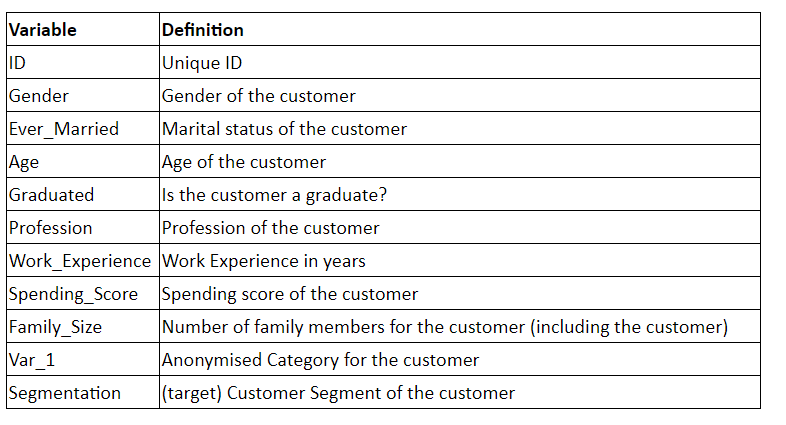

# Customer_Segmentation
Analyticsvidhya_Janatahack

Customer segmentation is the practice of dividing a customer base into groups of individuals that are similar in specific ways relevant to marketing, such as age, gender, interests and spending habits.

Companies employing customer segmentation operate under the fact that every customer is different and that their marketing efforts would be better served if they target specific, smaller groups with messages that those consumers would find relevant and lead them to buy something. Companies also hope to gain a deeper understanding of their customers' preferences and needs with the idea of discovering what each segment finds most valuable to more accurately tailor marketing materials toward that segment.

## Problem Statement

An automobile company has plans to enter new markets with their existing products (P1, P2, P3, P4 and P5). After intensive market research, they’ve deduced that the behavior of new market is similar to their existing market. 

In their existing market, the sales team has classified all customers into 4 segments (A, B, C, D ). Then, they performed segmented outreach and communication for different segment of customers. This strategy has work exceptionally well for them. They plan to use the same strategy on new markets and have identified 2627 new potential customers. 

You are required to help the manager to predict the right group of the new customers.

### Data Description

ID: Unique ID

Segmentation: Predicted segment for customers in the test set

### Feature Engineering

#### Handling missing values:

- Graduated -> Based on assumption ( if homemaker, not graduated or graduated)

- Ever Married -> Based on assumption ( if person is less than 35 they are not married ever or they have been married/sepreated now)

- Family_size  -> Looks reasonable to fill with the median value(3)

- Proffession and Var_1 -> 2 assumption
                        ->Both cannot be filled based on assumption as it require mose intution of the data ( so for the time sake I'm dropping the nan)
                        -> Filling with forwardfill,backwardfill to avoid the variation in the importance
- Work Experience  -> KNN imputer 
                   -> Due to more number of null values rather than assumption going for KNN imputer to fill the NAN values

#### Dummies/Label_Encoding

- Manual Encoding -> Gender,Ever_Married,Graduated,Spending_score,Var_1(As it was better than dummies or label encoding because of the ordinal manual mapping)

### Evaluation Metric

The evaluation metric for this hackathon is Accuracy Score.

### Model and their Performance

- Overall XG boost perfromed best in the evaluation metric
- Yet, when executing the new variables from the test, Random Forest provided greater accuracy_metric.
